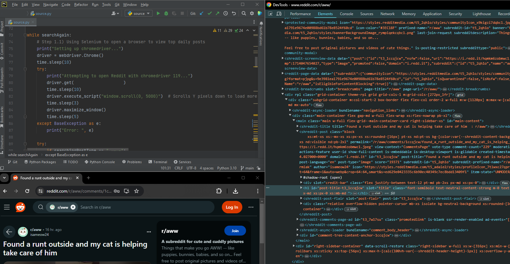

<h1 align="center">Social Media Scraper</h1>
<h3 align="center"> A  Python script that uses Selenium and ChromeDriver to download social media content.</h3>
 

  

&nbsp;

<h2 align = "center">Information</h2> 
<h3 align="left">Program Information:</h3>
<ul>
    <li>
Language: Python
</li>
    <li>
Purpose or Functionality: The program accesses websites and downloads content by using a combination of Selenium, Requests, and specific HTML elements.
</li>
    <li>
Host Operating Systems: Ubuntu LTS 22.04 • Windows 10/11
</li>
</ul>

&nbsp;

<h3 align="left">Features and Implementations:</h3>
<ul>
    <li>
Scraping Websites: The program scrapes website data by searching specific element information such as "id", "class", "src".
</li>
    <li>
Deleting Unneeded Data: After texts and images are downloaded and no longer needed, the program checks for any existing files in its directory with a specific filetype, then deletes those files. 
</li>
    <li>
Error Handling: When scraping websites, the program may fail due to failed website loading, outdated ChromeDriver files, HTML page restructures, etc. The program will display the error to the console which helps debugging.
</li>
</ul>

&nbsp;

<h3 align="left">Packages Used:</h3>
<ul>
    <li>
Selenium: Is used alongside ChromeDriver to simulate web browsing.
</li>
    <li>
Requests: Is used to download content such as images from a website.
</li>
    <li>
SQLite3: Is used to store a social media post's unique identifier to prevent duplicate downloads of a post.
</li>
    <li>
Pyperclip: Is 1 of 2 methods used to store text from HTML elements.
</li>
    <li>
OS: Is used to delete downloaded files before the program ends.
</li>
    <li>
Time: Is used to wait for website loading and content downloading to finish completely before continuing program.
</li>
</ul>

&nbsp;

<h2 align="center">Code Confidentiality</h2>

I've chosen to keep the source code private for this personal project to protect its confidentiality and maintain control over its distribution. While the code won't be publicly available, I'm more than happy to discuss the project's functionality, features, and implementation details. I appreciate your understanding and apologize for any inconvenience this may cause.

